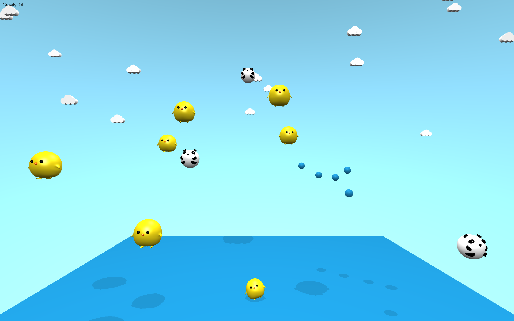

# leaplay

An Interactive 3D scene with Leap Motion. Featuring
[three.js](https://github.com/mrdoob/three.js),
[cannon.js](https://github.com/schteppe/cannon.js) and
[leapjs](https://github.com/leapmotion/leapjs)

[Video Demo](https://youtu.be/_64q8yN1AwE) |
[Live Demo](http://neolwc.github.io/leaplay)
(You will need a Leap Motion controller for this.)

[](https://youtu.be/_64q8yN1AwE)

## Tutorial

1. Initial file setup

	Download the dependent libraries, and put them in the `index.html`:

	```HTML
	<script src="three.min.js"></script>
	<script src="cannon.min.js"></script>
	<script src="leap.min.js"></script>
	```

2. Initialize the three.js scene

	Here's a template below from
	[threejs.org](http://threejs.org/docs/index.html#Manual/Introduction/Creating_a_scene):

	```HTML
	<html>
		<head>
			<title>My first Three.js app</title>
			<style>
				body { margin: 0; }
				canvas { width: 100%; height: 100%; }
			</style>
		</head>
		<body>
			<script src="js/three.js"></script>
			<script>
				var scene = new THREE.Scene();
				var camera = new THREE.PerspectiveCamera( 75, window.innerWidth/window.innerHeight, 0.1, 1000 );

				var renderer = new THREE.WebGLRenderer();
				renderer.setSize( window.innerWidth, window.innerHeight );
				document.body.appendChild( renderer.domElement );

				var geometry = new THREE.BoxGeometry( 1, 1, 1 );
				var material = new THREE.MeshBasicMaterial( { color: 0x00ff00 } );
				var cube = new THREE.Mesh( geometry, material );
				scene.add( cube );

				camera.position.z = 5;

				var render = function () {
					requestAnimationFrame( render );

					cube.rotation.x += 0.1;
					cube.rotation.y += 0.1;

					renderer.render(scene, camera);
				};

				render();
			</script>
		</body>
	</html>
	```

3. Setup the physical world with cannon.js

	Here's an example below from
	[cannon.js](https://github.com/schteppe/cannon.js#example):

	```JavaScript
	// Setup our world
	var world = new CANNON.World();
	world.gravity.set(0, 0, -9.82); // m/s²

	// Create a sphere
	var radius = 1; // m
	var sphereBody = new CANNON.Body({
		mass: 5, // kg
		position: new CANNON.Vec3(0, 0, 10), // m
		shape: new CANNON.Sphere(radius)
	});
	world.addBody(sphereBody);

	// Create a plane
	var groundBody = new CANNON.Body({
		mass: 0 // mass == 0 makes the body static
	});
	var groundShape = new CANNON.Plane();
	groundBody.addShape(groundShape);
	world.addBody(groundBody);

	var fixedTimeStep = 1.0 / 60.0; // seconds
	var maxSubSteps = 3;

	// Start the simulation loop
	var lastTime;
	(function simloop(time){
		requestAnimationFrame(simloop);
		if(lastTime !== undefined){
			var dt = (time - lastTime) / 1000;
			world.step(fixedTimeStep, dt, maxSubSteps);
		}
		console.log("Sphere z position: " + sphereBody.position.z);
		lastTime = time;
	})();
	```

4. Render the physical world with the 3D scene

	Within the `render` function:

	```JavaScript
	mesh.position.copy(body.position);
	mesh.quaternion.copy(body.quaternion);
	```

	You can find a full example and more from
	[here](https://github.com/schteppe/cannon.js/tree/master/examples#threejs).

5. Use the Leap Motion JavaScript SDK to track the hands

	```JavaScript
	Leap.loop(function (frame) {
		// https://developer.leapmotion.com/documentation/javascript/devguide/Leap_Hand.html
		frame.hands // returns an array of hands within the tracking area
	});
	```

	There's a
	[complete documentation](https://developer.leapmotion.com/documentation/javascript/index.html)
	from the Leap Motion developer website.

**After setting up all these above, you can start your own thing and get it going!**

*There is also a [plugin] I built to have three.js and cannon.js working together.*

[plugin]: https://github.com/neolwc/three-cannon
